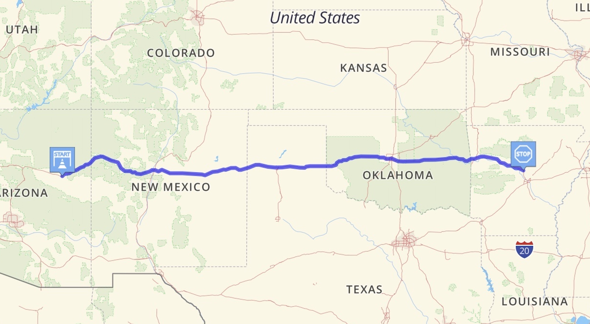

This repo documents my attempt at riding the Saddlesore 1000 - a 1000 mile motorcycle ride in 24 hours.  The plan is to start in Gallup, New Mexico and take I-40 east to Arkansas, crossing the 1000 mile mark just outside of Russellville, AR.

[/index.html](https://rfreynol.github.io/saddlesore1000/) contains a publicly available website documenting the ride.

[/images](https://github.com/rfreynol/saddlesore1000/tree/main/images)  contains images of the odometer and gas receipts

[/gpx](https://github.com/rfreynol/saddlesore1000/tree/main/gpx) contains GPS files from two devices used to record the ride: a Garmin Tread and a Garmin Montana.

My [Spotwalla Trip Page](https://spotwalla.com/trip/d0a4-2383835e-2f7f/view) has tracks from both my SPOT and Garmin InReach trackers.

